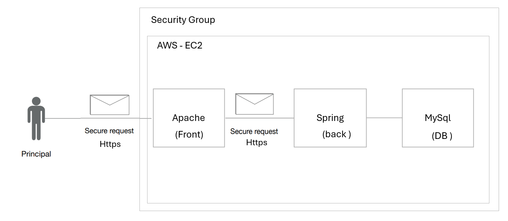
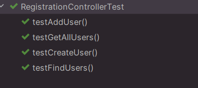

# Taller de arquitectura empresarial: Diseño de aplicaciones de seguridad

En este taller, se desarrolló una aplicación segura y escalable utilizando AWS, compuesta por dos componentes principales. El servidor Apache gestiona el frontend, mientras que el servidor de Spring Framework se encarga del backend.

Para garantizar la seguridad, se implementó cifrado TLS utilizando certificados de Let's Encrypt en ambos servidores. Además, mediante Spring Security, se definieron las políticas de autenticación y autorización de usuarios. Las contraseñas se encriptaron utilizando la interfaz PasswordEncoder junto con el algoritmo de hashing bcrypt, lo que asegura un manejo seguro de las credenciales.

## Arquitectura



1. **Servidor 1: Servidor Apache**
    - El servidor Apache será responsable de brindar servicio a un cliente HTML+JavaScript asincrónico a través de una conexión segura mediante TLS. El código del lado del cliente se entregará a través de canales cifrados, lo que garantiza la integridad y confidencialidad de los datos durante la descarga.
2. **Servidor 2: Spring Framework**
    - El servidor Spring se encargará de los servicios de backend y ofrecerá puntos finales de API RESTful. Estos servicios también estarán protegidos mediante TLS, lo que garantiza una comunicación segura entre el cliente y el backend.
    - Se utilizó el patrón de diseño arquitectónico **Modelo-Vista-Controlador**

3. **Componente MySQL (Base de datos):**
    - Este componente es la base de datos MySQL implementado en un servidor diferente.
      El componente Spring se comunica con MySQL a través de una conexión de red utilizando Spring Data JPA para realizar operaciones de lectura y escritura en la base de datos.
    - Se utiliza una base de datos MySQL para almacenar los usuarios y contraseñas de la aplicación.
    
4. AWS: Se utilizan los servicios de EC2 para la creación de una instancia para cada uno de los servicios anteriores.

- **Explicación de las clases en Spring** 
   - RegistrationController: Maneja las solicitudes relacionadas con el registro y la gestión de usuarios. 
      - createUser(): Registra un nuevo usuario en la base de datos.
      - addUser(): Agrega un usuario (método para administradores) y redirige a una página específica.
      - getAllUsers(): Devuelve una lista de todos los usuarios.
      - findUsers(): Devuelve los usuarios en formato ResponseEntity.
   - MyUser: Representa el modelo de datos del usuario en la aplicación.
     - Atributos: id, username, password, role
   - MyUserRepository: Interfaz que extiende JpaRepository para acceder a los datos de los usuarios.
   - SecurityConfiguration: Configura la seguridad de la aplicación en donde se establece la autorización del usuario. 
   - MyUserDetailService: Implementa UserDetailsService para cargar usuarios desde la base de datos, el cual posee la lógica para la autenticación del usuario- 
   - AuthenticationSuccessHandler: Maneja el éxito de la autenticación y redirige al usuario según su rol.
## Empezando

### Requisitos Previos
Para ejecutar este proyecto, necesitarás tener instalado:

- Java JDK 17.
- Un IDE de Java como IntelliJ IDEA, Eclipse, o NetBeans.
- Maven para manejar las dependencias preferiblemente la version 3.9.4
- Un navegador web para interactuar con el servidor.

### Instalación

1. Tener instalado Git en tu máquina local
2. Elegir una carpeta en donde guardes tu proyecto
3. abrir la terminal de GIT --> mediante el click derecho seleccionas Git bash here
4. Clona el repositorio en tu máquina local:
   ```bash
   git clone https://github.com/Medina95/TallerSeguridadArem.git
   ```
5. **IMPORTANTE**:
    - En application.properties tiene que cambiar el usuario en ***spring.datasource.username*** por root o por un usuario que tenga predefinido.
    - En **spring.datasource.password** cambié la contraseña por su contraseña de base de datos.
    - Finalmente, cambie su IP en **spring.datasource.url** por localhost:3306 o una específica como las de AWS y no olvide que la base se llama security.


## Deployment
1. Abre el proyecto con tu IDE favorito o navega hasta el directorio del proyecto
2. Desde la terminal para compilar y empaquetar el proyecto ejecuta:

   ```bash
   mvn clean install
   ```
3.  Compila el proyecto que contiene el método MAIN: SpringbackApplication.java o ejecuta desde la terminal

```bash
mvn spring-boot:run
```

4. Puedes interactuar con los endpoints RESTful API con:
    - http://localhost:8080/api/get/users  para obtener todos los usuarios 
    - http://localhost:8080/api/register/user dado que la parte gráfica está en apache, puedes registrar un usuario por postman de esta manera: 

    ```bash
        {
        "username": "caro",
        "password": "1234",
        "role": "ADMIN"
        }
    ```
      

## Despliegue en AWS

- **Video**:
  [despliegue en AWS funcionando](https://drive.google.com/file/d/1ll3aPTMM3jSG-ICfOvjnJYcw2ehXw-0N/view?usp=sharing)


## Ejecutar las pruebas

El proyecto incluye pruebas unitarias que simulan el comportamiento del servicio y del controlador:
1. Desde la terminal ejecutas:
   ```bash
   mvn test
   ```
### Desglosar en pruebas de extremo a extremo
- **testLoadUser**: Prueba para cargar un usuario existente, Verifica que un usuario válido sea cargado correctamente y que el rol se asigne adecuadamente.
- **testLoadAdmin()**: Prueba para cargar un administrador, Verifica que un usuario con rol ADMIN sea cargado correctamente y que el rol se asigne adecuadamente.
- **testLoadUserByUsername_UserNotFound()**: Prueba para manejar un usuario no encontrado Verifica que se lance una excepción UsernameNotFoundException al intentar cargar un usuario que no existe.
- **testCreateUser()** Prueba para crear un nuevo usuario Verifica que un nuevo usuario sea creado y que su contraseña esté en formato hash.
- **testAddUser()**:Prueba para agregar un usuario como administrador Verifica que se redirija correctamente después de agregar un nuevo usuario.
- **testGetAllUsers()**:Prueba para obtener todos los usuarios Verifica que se devuelva la lista de usuarios correctamente.

### Ejemplo
 ```bash
    @Test
       @Test
    public void testLoadAdmin() {
        String username = "testuser";
        MyUser myUser = new MyUser();
        myUser.setUsername(username);
        myUser.setPassword("password");
        myUser.setRole("ADMIN");

        when(repository.findByUsername(username)).thenReturn(Optional.of(myUser));

        UserDetails userDetails = userDetailService.loadUserByUsername(username);

        assertNotNull(userDetails); // Verifica que userDetails no sea nulo
        assertEquals(username, userDetails.getUsername()); // Verifica que el nombre de usuario sea correcto**
        assertEquals("password", userDetails.getPassword()); // Verifica que la contraseña sea correcta**

        assertTrue(userDetails.getAuthorities().stream()
                .anyMatch(authority -> authority.getAuthority().equals("ROLE_ADMIN"))); // Verifica que tenga el rol ADMIN**
    }
      
   ```




## Built With
* [Maven](https://maven.apache.org/) - Dependency Management

## Authors

* **Carolina Medina Acero** - [Medina95](https://github.com/Medina95)
